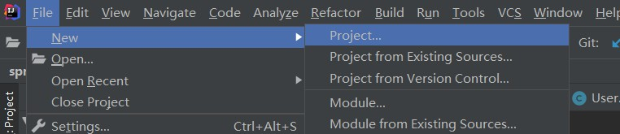
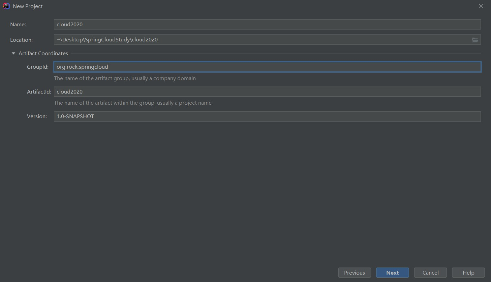
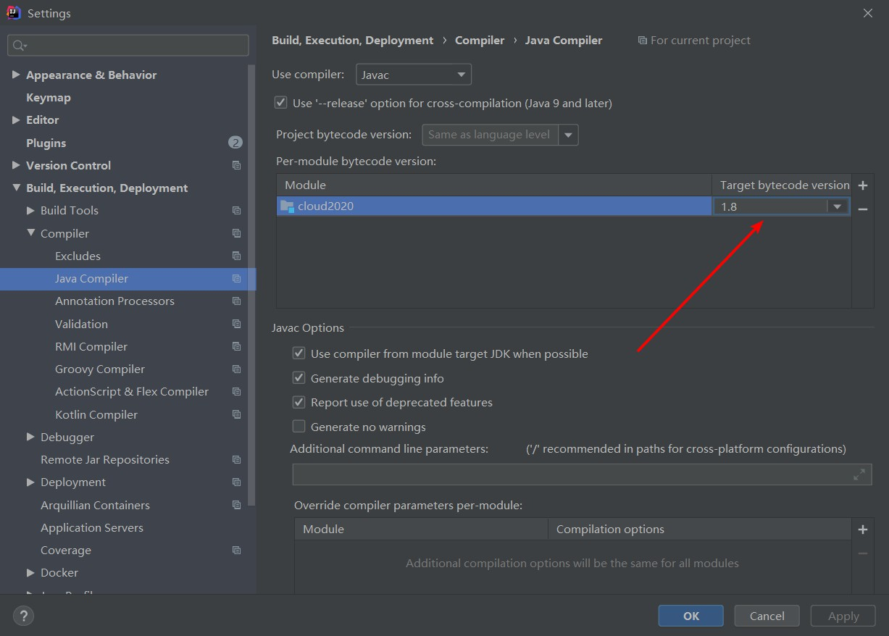

# 一、什么是SpringCloud

 分布式微服务架构的一站式解决方案，是多种微服务架构落地技术的几何体，俗称微服务全家桶

# 二、SpringCloud技术栈


# 三、版本选择

## 1、SpringBoot版本选择

**官网查看版本：**https://spring.io/projects/spring-boot#learn

**GitHub地址：**https://github.com/spring-projects/spring-boot/releases/

**SpringBoot2.0新特性：**https://github.com/spring-projects/spring-boot/wiki/Spring-Boot-2.0-Release-Notes


## 2、SpringCloud版本选择

**官网：**https://spring.io/projects/spring-cloud

**GitHub地址：**https://github.com/spring-projects/spring-cloud/wiki

**SpringCloud版本命名规则：**


## 3、SpringBoot与SpringCloud版本之间的依赖

网址：https://spring.io/projects/spring-cloud#overview

强烈推荐使用依赖为SpringBoot2.x及其以上版本

更详细的依赖查看方法：https://start.spring.io/actuator/info

# 四、停更说明

## Cloud升级

### 1、服务注册中心

Eureka：停更

Zookeeper

Consul

Nacos：推荐

### 2、服务调用1

Ribbon

LoadBalancer

### 3、服务调用2

Feign：停更

OpenFeign：推荐

### 4、服务降级

Hystrix：停更（国内大规模使用）

resilience4j：官网推荐

Sentinel：阿里版本（推荐）

### 5、服务网关

Zuul：停更

gateway：推荐

### 6、服务配置

config：停更

Nacos：阿里版本（推荐）

### 7、服务总线

Bus：停更

Nacos：推荐

SpringCloud文档：https://cloud.spring.io/spring-cloud-static/Hoxton.SR1/reference/htmlsingle/

中文文档：https://www.bookstack.cn/read/spring-cloud-docs/docs-index.md

SpringBoot文档：https://docs.spring.io/spring-boot/docs/2.2.2.RELEASE/reference/htmlsingle/


# 五、微服务cloud整体聚合父工程Project

## 1、新建项目

第一步：



第二步：


第三步：



第四步：


第五步：修改字符编码


第六步：注解生效激活


第六步：Java编译版本选择



## 2、项目的处理

第一步：删除src

 

第二步：父工程pom.xml

```xml
<!--聚合工程改为pom-->
  <packaging>pom</packaging>

  <!-- 统一管理jar包版本 -->
  <properties>
    <project.build.sourceEncoding>UTF-8</project.build.sourceEncoding>
    <maven.compiler.source>1.8</maven.compiler.source>
    <maven.compiler.target>1.8</maven.compiler.target>
    <junit.version>4.12</junit.version>
    <log4j.version>1.2.17</log4j.version>
    <lombok.version>1.16.18</lombok.version>
    <mysql.version>5.1.47</mysql.version>
    <druid.version>1.1.16</druid.version>
    <mybatis.spring.boot.version>1.3.0</mybatis.spring.boot.version>
  </properties>

  <!-- 子模块继承之后，提供作用：锁定版本+子modlue不用写groupId和version  -->
  <dependencyManagement>
    <dependencies>
      <!--spring boot 2.3.3-->
      <dependency>
        <groupId>org.springframework.boot</groupId>
        <artifactId>spring-boot-dependencies</artifactId>
        <version>2.3.3.RELEASE</version>
        <type>pom</type>
        <scope>import</scope>
      </dependency>
      <!--spring cloud Hoxton.SR8-->
      <dependency>
        <groupId>org.springframework.cloud</groupId>
        <artifactId>spring-cloud-dependencies</artifactId>
        <version>Hoxton.SR8</version>
        <type>pom</type>
        <scope>import</scope>
      </dependency>
      <!--spring cloud alibaba 2.2.2.RELEASE-->
      <dependency>
        <groupId>com.alibaba.cloud</groupId>
        <artifactId>spring-cloud-alibaba-dependencies</artifactId>
        <version>2.2.2.RELEASE</version>
        <type>pom</type>
        <scope>import</scope>
      </dependency>

      <dependency>
        <groupId>mysql</groupId>
        <artifactId>mysql-connector-java</artifactId>
        <version>${mysql.version}</version>
      </dependency>
      <dependency>
        <groupId>com.alibaba</groupId>
        <artifactId>druid</artifactId>
        <version>${druid.version}</version>
      </dependency>
      <dependency>
        <groupId>org.mybatis.spring.boot</groupId>
        <artifactId>mybatis-spring-boot-starter</artifactId>
        <version>${mybatis.spring.boot.version}</version>
      </dependency>
      <dependency>
        <groupId>junit</groupId>
        <artifactId>junit</artifactId>
        <version>${junit.version}</version>
      </dependency>
      <dependency>
        <groupId>log4j</groupId>
        <artifactId>log4j</artifactId>
        <version>${log4j.version}</version>
      </dependency>
      <dependency>
        <groupId>org.projectlombok</groupId>
        <artifactId>lombok</artifactId>
        <version>${lombok.version}</version>
        <optional>true</optional>
      </dependency>
    </dependencies>
  </dependencyManagement>

  <name>Maven</name>
  <!-- FIXME change it to the project's website -->
  <url>http://maven.apache.org/</url>
  <inceptionYear>2001</inceptionYear>

  <distributionManagement>
    <site>
      <id>website</id>
      <url>scp://webhost.company.com/www/website</url>
    </site>
  </distributionManagement>

  <build>
    <pluginManagement><!-- lock down plugins versions to avoid using Maven defaults (may be moved to parent pom) -->
      <plugins>
        <plugin>
          <groupId>org.springframework.boot</groupId>
          <artifactId>spring-boot-maven-plugin</artifactId>
          <configuration>
            <fork>true</fork>
            <addResources>true</addResources>
          </configuration>
        </plugin>
        <plugin>
          <artifactId>maven-clean-plugin</artifactId>
          <version>3.1.0</version>
        </plugin>
        <plugin>
          <artifactId>maven-site-plugin</artifactId>
          <version>3.7.1</version>
        </plugin>
        <plugin>
          <artifactId>maven-project-info-reports-plugin</artifactId>
          <version>3.0.0</version>
        </plugin>
      </plugins>
    </pluginManagement>
    <plugins>
      <plugin>
        <groupId>org.apache.maven.plugins</groupId>
        <artifactId>maven-site-plugin</artifactId>
        <configuration>
          <locales>en,fr</locales>
        </configuration>
      </plugin>
    </plugins>
  </build>
```

第三步：使用maven命令install 安装查看是否成功

## 3、Maven中的dependencyManagement和dependencies

**dependencyManagement：**


# 六、支付模块

## 1、新建支付模块

第一步：


第二步：


第三步：


第四步：更改pom.xml

```xml
<dependencies>
    <dependency>
        <groupId>org.springframework.boot</groupId>
        <artifactId>spring-boot-starter-web</artifactId>
    </dependency>

    <dependency>
        <groupId>org.springframework.boot</groupId>
        <artifactId>spring-boot-starter-actuator</artifactId>
    </dependency>

    <dependency>
        <groupId>org.mybatis.spring.boot</groupId>
        <artifactId>mybatis-spring-boot-starter</artifactId>
    </dependency>

    <dependency>
        <groupId>com.alibaba</groupId>
        <artifactId>druid-spring-boot-starter</artifactId>
        <!--如果不加则用父工程定义的-->
        <version>1.1.10</version>
    </dependency>

    <dependency>
        <groupId>mysql</groupId>
        <artifactId>mysql-connector-java</artifactId>
    </dependency>

    <dependency>
        <groupId>org.springframework.boot</groupId>
        <artifactId>spring-boot-starter-jdbc</artifactId>
    </dependency>

    <dependency>
        <groupId>org.springframework.boot</groupId>
        <artifactId>spring-boot-devtools</artifactId>
        <scope>runtime</scope>
        <optional>true</optional>
    </dependency>

    <dependency>
        <groupId>org.projectlombok</groupId>
        <artifactId>lombok</artifactId>
        <optional>true</optional>
    </dependency>

    <dependency>
        <groupId>org.springframework.boot</groupId>
        <artifactId>spring-boot-starter-test</artifactId>
        <scope>test</scope>
    </dependency>
</dependencies>
```

第五步：配置yml

```yaml
server:
  port: 8001
spring:
  application:
    name: cloud-payment-service # 服务名称
  datasource:
    type: com.alibaba.druid.pool.DruidDataSource # 当前数据源操作类型
    driver-class-name: org.gjt.mm.mysql.Driver # MySQL驱动包
    url: jdbc:mysql://192.168.3.24:3306/payment?useUnicode=true&characterEncoding=utf-8&useSSL=false
    username: root
    password: 123456

mybatis:
  mapperLocations: classpath:mapper/*.xml
  type-aliases-package: com.rock.entities # 所有Entity别名类所在包
```

第六步：编写启动类

```java
@SpringBootApplication
public class PaymentMain8001 {
    public static void main(String[] args) {
        SpringApplication.run(PaymentMain8001.class,args);
    }
}
```

第七步：创建数据库以及表

```mysql
CREATE TABLE IF NOT EXISTS payment(
	id BIGINT(20) UNSIGNED AUTO_INCREMENT,
	serial VARCHAR(50) NOT NULL,
	PRIMARY KEY(id)
)ENGINE=INNODB DEFAULT CHARSET=utf8;
```

第八步：编写代码

Entity：

```java
public class Payment implements Serializable {

    private Long id;

    private String serial;

    public Long getId() {
        return id;
    }

    public void setId(Long id) {
        this.id = id;
    }

    public String getSerial() {
        return serial;
    }

    public void setSerial(String serial) {
        this.serial = serial;
    }

    public Payment() {
    }

    public Payment(Long id, String serial) {
        this.id = id;
        this.serial = serial;
    }
}
```

```java
public class CommonResult<T> {

    private Integer code;

    private String message;

    private T data;

    public CommonResult() {
    }

    public CommonResult(Integer code, String message){
        this(code,message,null);
    }

    public CommonResult(Integer code, String message, T data) {
        this.code = code;
        this.message = message;
        this.data = data;
    }

    public Integer getCode() {
        return code;
    }

    public void setCode(Integer code) {
        this.code = code;
    }

    public String getMessage() {
        return message;
    }

    public void setMessage(String message) {
        this.message = message;
    }

    public T getData() {
        return data;
    }

    public void setData(T data) {
        this.data = data;
    }
}
```

dao：

```java
@Mapper
public interface PaymentDao {

    int add(Payment payment);

    Payment getPaymentById(@Param("id") Long id);
}
```

```xml
<?xml version="1.0" encoding="UTF-8"?>
<!DOCTYPE mapper PUBLIC "-//mybatis.org//DTD Mapper 3.0//EN" "http://mybatis.org/dtd/mybatis-3-mapper.dtd">
<mapper namespace="com.rock.dao.PaymentDao">

    <insert id="add" parameterType="Payment" useGeneratedKeys="true" keyProperty="id">
        insert into payment(serial) values (#{serial})
    </insert>

    <!--数据映射-->
    <resultMap id="BaseResultMap" type="com.rock.entities.Payment">
        <id column="id" property="id" jdbcType="BIGINT"/>
        <id column="serial" property="serial" jdbcType="VARCHAR"/>
    </resultMap>
    <select id="getPaymentById" parameterType="Long" resultType="Payment">
        select * from payment where id = #{id}
    </select>
   <!-- <select id="getPaymentById" parameterType="Long" resultMap="BaseResultMap">
        select * from payment where id = #{id}
    </select>-->
</mapper>
```


